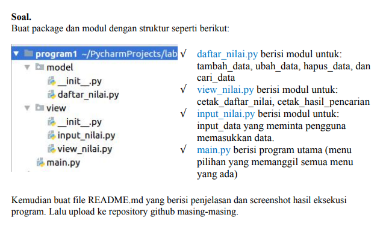
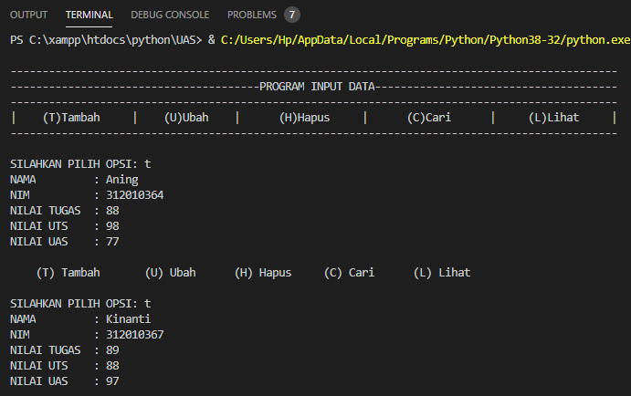
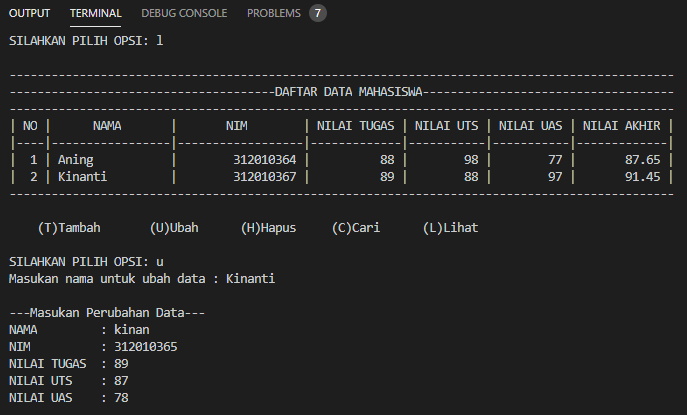
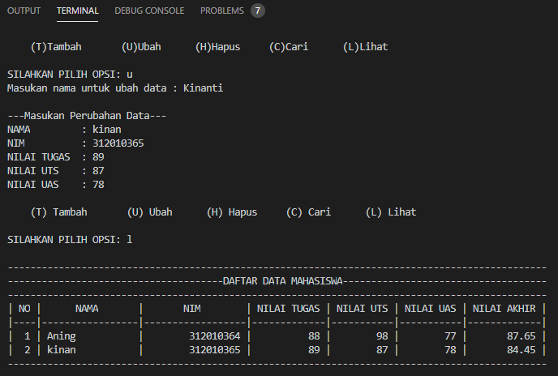
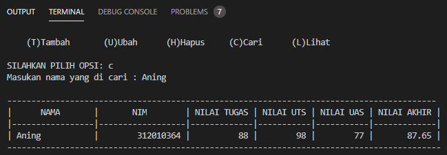
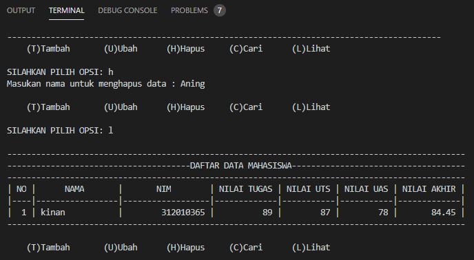

# - Uas Bahasa Pemrograman -

| NAMA | NIM | KELAS | MATAKULIAH |
| -- | --- | ---- | ----------- |
| ANING KINANTI | 312010364 | TI.20.A2 | BAHASA PEMROGRAMAN |

## • SOAL UAS

## • PROGRAM SAYA
Pada modul program yang tertera diatas, berikut adalah ss berjalannya program (output program) beserta penjelasan singkatnya.  
Program akan berjalan seperti dibawah ini :  

### • OPSI TAMBAH DATA

Pada mulanya user akan diminta untuk memilih opsi, disini dicontohkan 't' untuk tambah data.  
Pada opsi ini user dapat menambahkan data mahasiswa yang meliputi nama, nim, nilai tugas, nilai uts, nilai uas.  
Apabila data berhasil ditambahkan user bisa memilih opsi 'l' atau lihat untuk melihat data yang terlah ditambahkan.  

### • OPSI LIHAT DATA

Gambar diatas merupakan contoh dari opsi 'l' atau lihat data.  
Pada opsi ini user dapat melihat data mahasiswa yang telah ditambahan sebelumnya.  

### • OPSI UBAH DATA

Gambar diatas merupakan contoh dari opsi 'u' atau ubah data.  
Yang memiliki fungsi untuk mengubah atau mengedit data yang telah diinputkan, biasanya hal ini diperlukan apabila user salah dalam menginputkan data.  
Data dapat diubah dengan cara user akan diminta memasukan nama yang akan diubah, lalu user akan diminta untuk memasukan data baru.  
Apabila data berhasil diubah user bisa memilih opsi 'l' atau lihat untuk melihat data yang terlah diubah.  

### • OPSI CARI DATA

Gambar diatas merupakan contoh dari opsi 'c' atau cari data.  
Yang memiliki fungsi untuk mencari data yang telah diinputkan berdasarkan nama.  

### • OPSI HAPUS CARI

PGambar diatas merupakan contoh dari opsi 'h' atau hapus data.  
Yang memiliki fungsi untuk menghapus data yang telah diinputkan berdasarkan nama.  
Untuk memastikan kembali apakah data sudah terhapus, user dapat memilih opsi 'l'. <br.>

